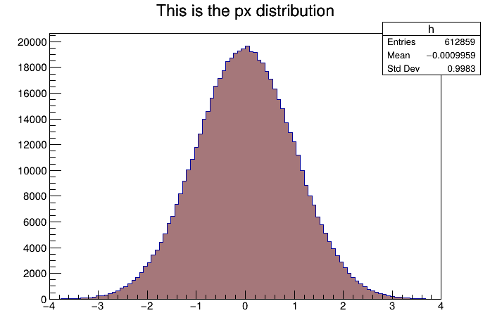
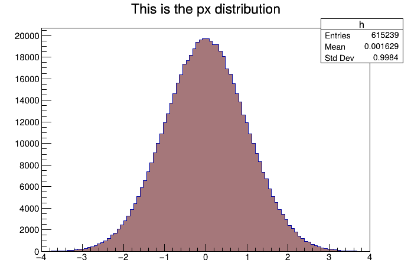
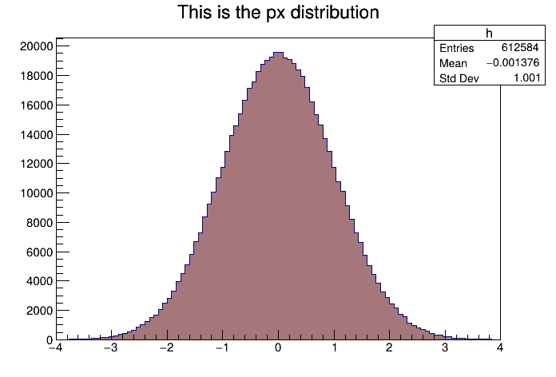
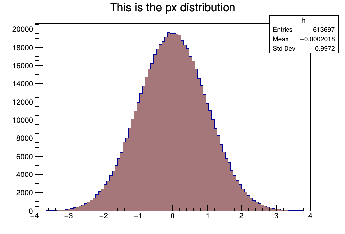
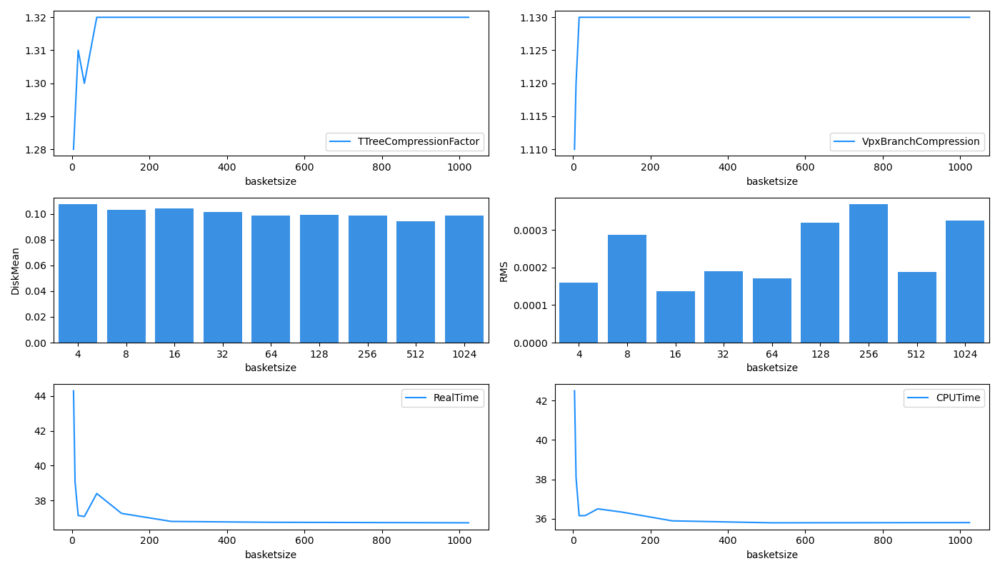

# CP2-IO
Assignment for C2-THE-C2 Course

# Homework based on Day 1 exercises
If we take a look at the code from Day 1, https://github.com/jahreda/c2-the-p2/tree/main/IO/day1, we have an opportunity to fill branches with multiple types of data at once. Running N = 1e8 and larger will take at least an hour and it will blow up the ROOT files of each flush configuration to ~45 GB. Keep this at or under 1e7, preferably 1e6!!

1. How might mixing the baskets with different kinds of data affect compression of the data upon filling the tree and saving to file? Does this have an effect with the overall disk usage or CPU walltime?

**Answer:** 
`IO/day1/Screenshots` contains two folders, `All_Floats` and `Mixed_Data_Types`. `All_Floats` contains screenshots of the five autoflush settings when the files were writted with the same datatypes. This was done by changing `vint` variable in `writeROOTFile.cpp` to a float type. `Mixed_Data_Types` contains screenshots of the five autoflush settings with `vint` set to integer type. Each folder also contains a `data.txt` file, where I manually saved the data from provided in the screenshot - later used in `data_types_analysis.ipynb`. 

The following are the results from changing all variables, px, py, pz and vint to float types versus maintaining vint to integer type: 

Hypothesis: I expect larger autoflush to increase efficiency in data usage and speed when writing the file.

Analysis: The CPU Time plot tells me that the by enabling autoflush, times go by quicker. It's also slightly faster when I had `vint` set to an integer type rather than float type. I think integer operations are generally faster than floating-point operations. I do think its interesting that the type dont seem to matter when autoflush was set to 100 entries. It almost behaved as if it was disabled. 
The Real Time plot shows similar results.
The Disk Mean plot significantly shows a difference between mixed datatypes versus floats. Int32 takes in 4 bytes and float64 takes in 8bytes, so I clearly see a reduced file size for each autoflush setting. 
The NRMS plot is interesting... Would this mean that setting autoflush by number of entriesis better than by MBytes? 

I also plotted the TTree Filesize: 

The size of the TTree also shows to be more efficient with mixed datatypes versus when they are all floats. 

And finally, the TTree Compression Factor:

Compression Factor is generally higher for mixed datatypes versus all floats. It's also interesting to see the compression factor to be lowest when autoflush is set to 100 entries, it is probably too low of a setting. 

2. Plot some histograms by calling back to the original hvector tutorial (you might want to use scp to move the plots from the AF to your local machine, just a thought 👀)

**Answer:** okay. 

	<figure>
		
		<figcaption>10MBytes</figcaption>
	</figure>
	<figure>
		
		<figcaption>30MBytes</figcaption>
	</figure>
	<figure>
  		
		<figcaption>autoflush disabled</figcaption>
	</figure>
	<figure>  
		
		<figcaption>10000 entries</figcaption>
	</figure>
	<figure>
  		
		<figcaption>100 entries</figcaption>
	</figure>

I used `IO/day1/hvector.C` to create these plots.

3. Once you have these, using tree->SetBasketSize(X), set the size of the basket buffer to values in this set: {4, 8, 16, 32, 64, 128, 256, 512, 1024} [kB] and take the corresponding compression factors of an individual branch (You can obtain this a couple ways, within the script or after the .root file is written) After this is written, plot the compression
factors according to the basket sizes.
a. Do this first with only random floating point numbers. After you get this, then you can fill the branches with (½ easily-compressible and ½ difficult-to-compress) numbers and see how that changes things.
b. What do you notice with the smaller basket sizes? The larger ones?
c. Do the benchmarks tell us anything useful?

**Answer:** `IO/day1/Screenshots/BasketSizes_Floats` contains screenshots of results generated using `writeROOTFile_baskets.cpp` and `readROOTFile_baskets.cpp`. The following are the results: 

Based off looking at the TTree Compression Factor and the Compression Factor for branch `vpx`, for lower batch sizes, the compression is low and then plateaus at basketsize = 128kB. The Disk Mean relatively stays the same throughout basketsizes, but the NRMS changes alot - I'm not sure what to make from this. The real times and CPU times both immediately drop at basketsize = 8 kB, goes back up a bit, I think at 64kB, and then exponentially drops, similar to damping.  

# Homework based on Day 2 exercises
If we take a look at the code from Day 2: https://github.com/jahreda/c2-the-p2/tree/main/IO/day2 there’s context to work with to add and remove decorations within a configuration job.
1. Of the decorations we were able to cover in class, can we get the ReadExampleElectron script to read back the decorations we set?
2. Add a decoration of your own, call it decor_<your name> and make it your favorite data type(assuming it’s compatible with C++ and the athena framework), play around with writing and reading it! See what works and what might not.

**Answer:** I first edited `IO/day2/WriteExampleElectron.h` to add my decorator, `decor_fatima` for integer types. Then I edited, `IO/day2/WriteExampleElectron.cxx` to initialize the decorator and also include a handle int `::execute()`. Then it crashed when I built it so I edited the output stream in `IO/day2/AthenaPoolExample_WritexAODElectrons.py` according to `IO/day2/README.md`. But my code still crashed and I can't figure it out. :frowning_face:  
