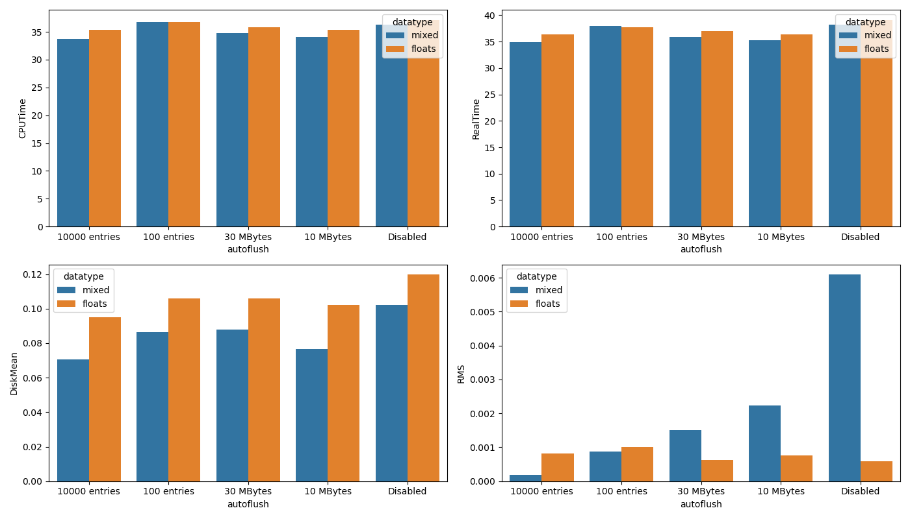
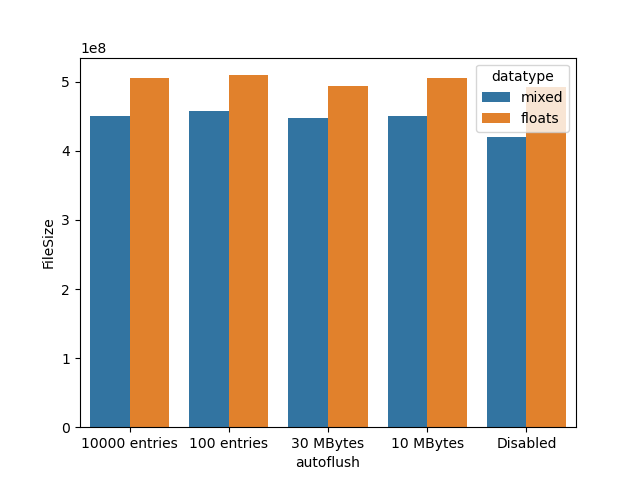
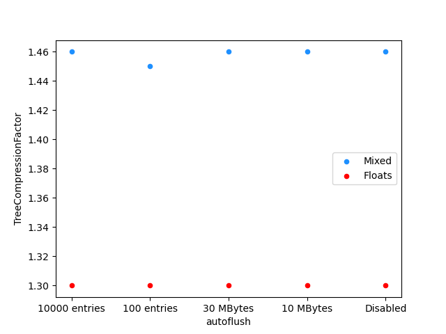

# CP2-IO
Assignment for C2-THE-C2 Course

# Homework based on Day 1 exercises
If we take a look at the code from Day 1, https://github.com/jahreda/c2-the-p2/tree/main/IO/day1, we have an opportunity to fill branches with multiple types of data at once. Running N = 1e8 and larger will take at least an hour and it will blow up the ROOT files of each flush configuration to ~45 GB. Keep this at or under 1e7, preferably 1e6!!

1. How might mixing the baskets with different kinds of data affect compression of the data upon filling the tree and saving to file? Does this have an effect with the overall disk usage or CPU walltime?

**Answer** 
`IO/day1/Screenshots` contains two folders, `All_Floats` and `Mixed_Data_Types`. `All_Floats` contains screenshots of the five autoflush settings when the files were writted with the same datatypes. This was done by changing `vint` variable in `writeROOTFile.cpp` to a float type. `Mixed_Data_Types` contains screenshots of the five autoflush settings with `vint` set to integer type. Each folder also contains a `data.txt` file, where I manually saved the data from provided in the screenshot - later used in `data_types_analysis.ipynb`. 

The following are the results from changing all variables, px, py, pz and vint to float types versus maintaining vint to integer type: 

Hypothesis: I expect larger autoflush to increase efficiency in data usage and speed when writing the file.

Analysis: The CPU Time plot tells me that the by enabling autoflush, times go by quicker. It's also slightly faster when I had `vint` set to an integer type rather than float type. I think integer operations are generally faster than floating-point operations. I do think its interesting that the type dont seem to matter when autoflush was set to 100 entries. It almost behaved as if it was disabled. 
The Real Time plot shows similar results.
The Disk Mean plot significantly shows a difference between mixed datatypes versus floats. Int32 takes in 4 bytes and float64 takes in 8bytes, so I clearly see a reduced file size for each autoflush setting. 
The NRMS plot is interesting... Would this mean that setting autoflush by number of entriesis better than by MBytes? 

I also plotted the TTree Filesize: 

The size of the TTree also shows to be more efficient with mixed datatypes versus when they are all floats. 

And finally, the TTree Compression Factor:

Compression Factor is generally higher for mixed datatypes versus all floats. It's also interesting to see the compression factor to be lowest when autoflush is set to 100 entries, it is probably too low of a setting. 

2. Plot some histograms by calling back to the original hvector tutorial (you might want to use scp to move the plots from the AF to your local machine, just a thought 👀)

okay. 

